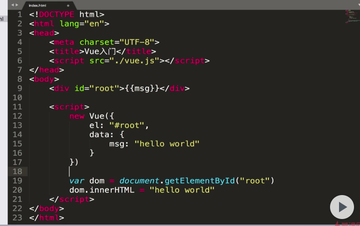

[vue2.5 写 todolist 课程网址](https://www.imooc.com/learn/980)
课程分节介绍
####2-1 如何使用 vue 模板

使用 vue 的方法如下：

1. 直接 script 标签引入
2. CDN
   本课程使用的 vue 是通过，script 引用开发版本

建一个新的文件夹，把 vue 的源码粘贴到文件 vue.js 里面

再建一个 index.html，可以直接写一个 vue 模板。 scrip 标签最好放在 head 里面，避免页面发生抖屏(课程老师是这么说的，但是对于我来说这是个 ❓)



####2-2
挂载点，模板，和实例之间的关系

####2-3 vue 实例中的数据，事件和方法

1. vue 和之前最大的区别就是不要去改 dom，直接更改数据就可以了。不是面向 dom 编程了，而是面向数据编程了
2. v-on 这个模板指令可以直接给元素绑定事件，这个事件被出发之后就会用它后面跟着的方法某个函数 @
3. 事件触发的方法应该写在 vue 实例里面的 methods 里面
   知道了实例数据绑定和方法展示

####2-4 属性绑定和双向数据绑定

1. v-bind 属性: 单向属性绑定， v-bind: 简写成 ":"
2. v-model 双向数据绑定

####2-5 计算属性和侦听器

1. computed: 计算属性：某个属性由其他属性计算而来
2. watch: 侦听器：某个计算属性或者侦听器发生了变化，就可以在侦听器里面写一些逻辑

####2-6 v-if v-show v-for

1. v-if 控制 dom 的存在与否
2. v-show 控制 dom 的显示与否
3. v-for 控制一组数据，用这组数据控制在页面上

####3-2 注册组件

1. 如何自由注册组件，局部组件和全局组件的在实例中注册和使用
2. 如何在自定义的组件中进行外部传值

####3-3 组件和实例关系

1. 每个组件都是一个 vue 实例，组件的编写方法其实和实例非常类似，也可以写 methods 也可以写 data

####3-4 实例

1. 实例没有模板就去找挂载点，也就是 el: 对应的挂载点，会把挂载点下面的所有 dom 标签作为模板

####3-5 父子组件的传递，用于实现 todolist 的删除功能

1. vue 中父组件向子组件传值是通过属性来传递的，需要用到 v-bind
2. 所以想在子组件中删除，必须把父组件对应的渲染子组件的数据给删除掉，所以需要实现子组件和父组件的通讯
3. 父子组件的交互，父组件向子组件传递数据通过属性来传递
4. 子组件向父组件传递数据，通过子组件发布一个事件，父组件恰好之前订阅了这个事件，于是通过发布订阅的方式，往父组件传递数据

---

###4 使用 vue-cli 这个脚手架工具写 todolist

####4-1 vue-cli 的安装和使用

vue-cli 感觉就是 vue 项目的  打包工具


```JavaScript
npn install --global vue-cli

vue init webpack 项目名字

cd 项目名字

npm run dev
```

然后初始的 vue 项目文件夹就安装好了

build 和 config 基本不动

node_modules 项目依赖

src 项目代码放的目录

static 放的是静态的资源

最外层 index.html 是挂载点

main.js 就是入口文件，写的  就是 index.html 的挂载点的 vue 实例

一般自己写的时候可以通过引入 vue.js，但是正常写项目的时候会借用 用 vue-cli 脚手架工具，webpack 打包工具帮助我们开发代码
